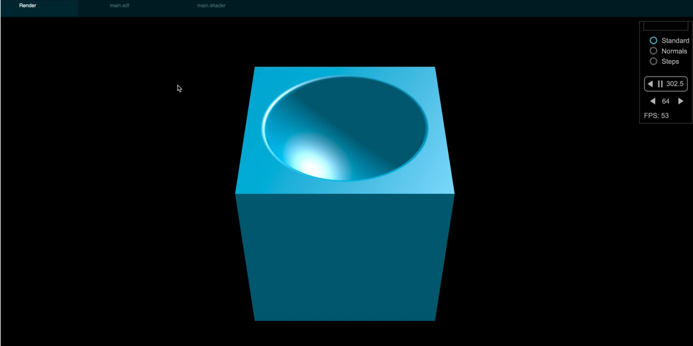

# Raymarching Playground

## [YouTube Demo](https://www.youtube.com/watch?v=D5bAk9fb6IA)

The Raymarching Playground uses React and WebGL. It features a node-based editor. Users can connect nodes to create
functions that represent the 3D geometry or the shading. The geometry is defined by a signed-distance field. The shading 
uses the Phong illumination model. The created object is rendered in real time using raymarching.

Geometry             |  Shading
:-------------------------:|:-------------------------:
  |  

### Rendered Result

